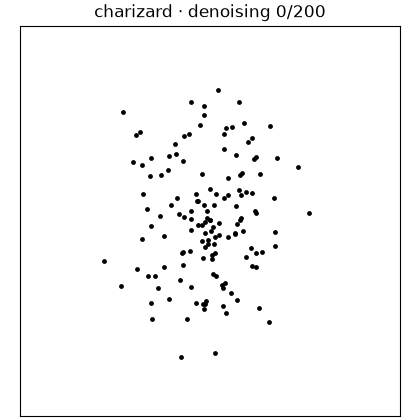
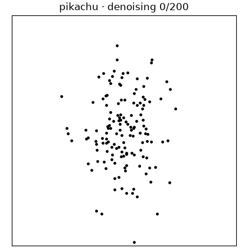

# Pokefusion: Pokémon Point-Cloud Diffusion

[](https://github.com/abitha-thankaraj/datasaurust/actions/workflows/ci.yml)

Generate statistically constrained Pokémon point clouds and train diffusion
models on them.

This repository extends [DatasauRust](https://github.com/araffin/datasaurust)
with a reproducible way to generate training data from Pokémon artwork and
train a point-cloud diffusion model on it. The extension turns each image into
a validated 142-point silhouette, then provides the training, sampling,
evaluation, and visualization workflow needed to learn from those datasets.

Every accepted cloud has the same full-precision mean, sample standard
deviations, and Pearson correlation as the original Datasaurus dataset. The
model learns shape from coordinates only; raster images are used for source
extraction and visual evaluation, never as training inputs.

## Pokefusion: a self-contained data and diffusion package

[`scripts/pokefusion/`](scripts/pokefusion) is a self-contained Python package
for generating the Pokémon point-cloud datasets and training diffusion models
on them. It keeps its own uv project and lockfile, OmegaConf configurations,
data acquisition and validation tools, model code, training and sampling entry
points, evaluation, and GIF visualization in one place. It installs as the
`pokefusion` import package and does not depend on the parent `scripts`
directory as a Python package.

This layout makes the boundary with DatasauRust explicit. The Rust crate remains
a separate component that can be built and used without Pokefusion, while
Pokefusion exchanges contours, point clouds, and run artifacts with the wider
repository through paths declared in its configurations.

## Denoising examples

Each animation starts from Gaussian noise and shows the actual 200-step reverse
DDPM trajectory. The final frame is projected back to the exact target moments.

| Bulbasaur | Charizard | Gengar | Lapras | Pikachu |
|---|---|---|---|---|
|  |  |  |  |  |

## Repository map

```text
scripts/pokefusion/configs/                runnable OmegaConf experiment YAMLs
scripts/pokefusion/data/                   acquire, extract, generate, and validate
scripts/pokefusion/train/                  train, check, sample, and evaluate DDPM
scripts/pokefusion/visualize/              render one denoising GIF per class
scripts/pokefusion/pyproject.toml          isolated uv environment definition
scripts/pokefusion/datasaurust_changelist.md  Rust extension notes and rationale
data/pokemon/contours/                  versioned deterministic contour artifacts
data/pokemon/manifest.jsonl             dataset provenance and acceptance records
data/pokemon/points/<species>/*.csv     generated 142 × 2 training examples
runs/<name>/                            checkpoints, samples, metrics, and GIFs
```

Large generated artifacts under `data/pokemon/points/` and `runs/` are ignored
by Git. Small contours, manifests, validation summaries, and documentation
examples are versioned.

## 1. Set up Python with uv

Requirements are Python 3.10–3.14 and
[`uv`](https://docs.astral.sh/uv/getting-started/installation/). From a clone of
this repository:

```bash
uv sync --project scripts/pokefusion
uv run --project scripts/pokefusion python -c \
  "import torch; print(torch.__version__, 'CUDA:', torch.cuda.is_available())"
```

`uv sync` creates an isolated environment for the Python subproject and installs
the dependencies declared in `scripts/pokefusion/pyproject.toml`. For a
platform-specific CUDA or ROCm build, select the wheel
recommended by the official [PyTorch installer](https://pytorch.org/get-started/locally/).
CPU execution works for data generation and small smoke tests; training is much
faster on a GPU.

The Rust CLI is optional for the Python diffusion workflow. To use it, install a
stable Rust toolchain and run `cargo test` once.

## 2. Choose any Pokémon

Copy the supplied configuration and replace its `pokemon` list. Adding a new
species requires only its lowercase PokéAPI name—no ID lookup, species-specific
mask, threshold, contour, or code change.

`my_pokemon.yaml` below is only an example filename; replace it with any valid
filename you prefer and use that same path in the following commands.

```bash
cp scripts/pokefusion/configs/data/five_pokemon.yaml \
  scripts/pokefusion/configs/data/my_pokemon.yaml
```

For example:

```yaml
pokemon:
  - squirtle
  - eevee
  - snorlax
```

Keep the shared `source_policy`, `extraction`, and `generation` sections from
the original configuration. The generic extractor prefers transparent official
artwork and falls back to the PokéAPI Home sprite.
PokéAPI resolves each name and supplies the canonical numeric ID recorded in
the source manifest and deterministic sample seeds.

## 3. Acquire artwork and generate point clouds

Every Pokémon command takes a YAML path followed by optional OmegaConf dot-list
overrides. Run the configured 16-example-per-class dataset first:

```bash
uv run --project scripts/pokefusion python \
  -m pokefusion.data.generate_pokemon_dataset \
  scripts/pokefusion/configs/data/my_pokemon.yaml

uv run --project scripts/pokefusion python \
  -m pokefusion.data.validate_pokemon_dataset \
  scripts/pokefusion/configs/data/my_pokemon.yaml
```

The generation command performs the complete data path:

1. fetches the configured PokéAPI records and official artwork;
2. records URLs, hashes, HTTP metadata, dimensions, and rights information;
3. extracts every silhouette through the same generic function;
4. writes masks, deterministic contours, and source/mask/contour QA previews;
5. creates headerless 142-row coordinate CSVs with exact shared moments; and
6. records seeds, hashes, measured statistics, shape metrics, and code/config
   versions in `data/pokemon/manifest.jsonl`.

Inspect `data/pokemon/previews/<name>.png` before scaling up. Then generate the
recommended first training volume:

```bash
uv run --project scripts/pokefusion python \
  -m pokefusion.data.generate_pokemon_dataset \
  scripts/pokefusion/configs/data/my_pokemon.yaml \
  generation.samples_per_species=128

uv run --project scripts/pokefusion python \
  -m pokefusion.data.validate_pokemon_dataset \
  scripts/pokefusion/configs/data/my_pokemon.yaml
```

To test the unchanged extractor on a Pokémon absent from the training config:

```bash
uv run --project scripts/pokefusion python \
  -m pokefusion.data.check_heldout_pokemon \
  scripts/pokefusion/configs/data/my_pokemon.yaml \
  heldout.pokemon_id=25 \
  heldout.out=data/pokemon/heldout_validation.json
```

## 4. Train the diffusion model

First make the model validate every training file, point count, and invariant:

```bash
uv run --project scripts/pokefusion python \
  -m pokefusion.train.check \
  scripts/pokefusion/configs/train/baseline.yaml
```

Run the 30,000-step baseline:

```bash
uv run --project scripts/pokefusion python \
  -m pokefusion.train.train \
  scripts/pokefusion/configs/train/baseline.yaml
```

Training uses an 80/10/10 stratified split, randomizes point order on every
access, whitens the shared covariance, predicts DDPM noise with a
permutation-equivariant Transformer, and saves EMA weights in
`runs/five_pokemon/checkpoint.pt`.

The training implementation follows the small, explicit style of
[tiny-diffusion](https://github.com/tanelp/tiny-diffusion): `data.py` owns the
statistical contract and whitening, `model.py` defines the denoiser,
`diffusion.py` writes out the forward and reverse equations, and `train.py`
contains the complete optimization loop. Comments explain the less obvious
choices, especially covariance, correlation, projection, and point-order
invariance.

For a fast end-to-end smoke test, use fewer steps and a smaller model:

```bash
uv run --project scripts/pokefusion python \
  -m pokefusion.train.train \
  scripts/pokefusion/configs/train/baseline.yaml \
  out=runs/setup_check \
  training.steps=200 \
  training.model_width=32 \
  training.model_layers=1 \
  training.diffusion_timesteps=20
```

## 5. Sample and evaluate

Generate eight point clouds per class:

```bash
uv run --project scripts/pokefusion python \
  -m pokefusion.train.sample \
  scripts/pokefusion/configs/sample/eight_per_class.yaml
```

The sampler writes coordinate CSVs, a labeled preview, a balanced blinded grid
and key, `metrics.json`, nearest-reference distances, diversity, and exact
training-match checks. Every serialized sample is reprojected and revalidated
against all five target statistics.

## 6. Render one denoising GIF per Pokémon

```bash
uv run --project scripts/pokefusion python \
  -m pokefusion.visualize.render_diffusion_gifs \
  scripts/pokefusion/configs/visualize/denoising_gifs.yaml
```

Useful controls:

```text
seed=321          reproducible initial noise and reverse trajectory
frame_stride=4    save every fourth denoising step
fps=12            output playback speed
device=auto       select CUDA, MPS, or CPU automatically
```

The output directory contains `<species>_denoising.gif` for every class stored
in the checkpoint.

## Rust runtime contours

The Rust optimizer accepts either a built-in shape or a generated runtime
contour. All optimizer randomness shares one seed, and final acceptance checks
the five full-precision statistics plus contour distance.

```bash
cargo run --release -- \
  --shape-file data/pokemon/contours/pikachu.csv \
  --seed 42 \
  --project-every 1000 \
  --stats-tolerance 1e-4 \
  --manifest-out logs/pikachu/manifest.json
```

The Rust-specific changes are listed with their rationale in
[`scripts/pokefusion/datasaurust_changelist.md`](scripts/pokefusion/datasaurust_changelist.md).

## Verification

```bash
uv run --project scripts/pokefusion python \
  -m pokefusion.train.check \
  scripts/pokefusion/configs/train/baseline.yaml
cargo fmt --all --check
cargo clippy --all-targets --all-features -- -D warnings
cargo test --all-targets --all-features
```

## Reproducibility and image rights

Seeds are derived deterministically from the global seed, Pokémon ID, sample
index, and attempt. Re-running with unchanged input bytes, configuration, and
code produces byte-identical contours, point CSVs, and manifests.

PokéAPI's sprite repository notes that Pokémon image contents are copyright The
Pokémon Company. Keep downloaded artwork isolated and use it only where your
intended research use is appropriate; do not infer commercial redistribution
rights from the sprite repository license.

The original DatasauRust implementation is based on the paper
[Same Stats, Different Graphs](https://www.autodesk.com/research/publications/same-stats-different-graphs)
by Justin Matejka and George Fitzmaurice.
