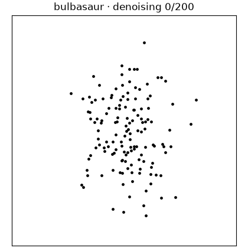
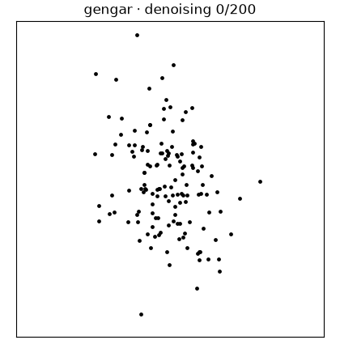
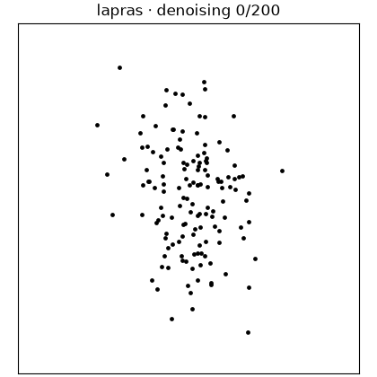

# Pokefusion: Pokémon Point-Cloud Diffusion

[](https://github.com/abitha-thankaraj/pokefusion/actions/workflows/ci.yml)

Give Pokefusion a list of Pokémon names. It fetches their artwork, traces each
silhouette, generates statistically constrained point-cloud training data, and
trains a diffusion model to create new examples.

```text
Pokémon names → artwork → 142-point datasets → diffusion model → new silhouettes + GIFs
```

The model learns from coordinates only; images are used to prepare and inspect
the dataset, never as model inputs. Every accepted point cloud retains the same
full-precision mean, sample standard deviations, and Pearson correlation as the
original Datasaurus dataset.

## Denoising examples

Each animation starts from Gaussian noise and shows the actual 200-step reverse
DDPM trajectory. The axes remain fixed throughout, and the final frame is
projected back to the exact target statistics.

| Bulbasaur | Charizard | Gengar | Lapras | Pikachu |
|---|---|---|---|---|
|  |  |  |  |  |

## What this fork adds

- A generic pipeline that fetches Pokémon artwork by name, extracts its contour,
  and generates validated 142-point training examples.
- A class-conditional point-cloud diffusion model with commands for training,
  sampling, evaluation, and denoising GIFs.
- OmegaConf YAML configurations and a locked uv environment for reproducible
  data generation and experiments.
- DatasauRust support for runtime contour CSVs, deterministic optimization,
  exact covariance projection, full-precision validation, and run manifests.
  See [`datasaurust_changelist.md`](datasaurust_changelist.md) for the complete
  list of Rust changes.

## Code organization

The Python workflow is a self-contained package under [`pokefusion/`](pokefusion).
The existing DatasauRust crate remains separate and can still be built and used
without the Python package.

```text
pokefusion/configs/                runnable OmegaConf experiment YAMLs
pokefusion/data/                   acquire, extract, generate, and validate
pokefusion/train/                  train, check, sample, and evaluate DDPM
pokefusion/visualize/              render one denoising GIF per class
pokefusion/pyproject.toml          isolated uv environment definition
datasaurust_changelist.md          Rust extension notes and rationale
data/pokemon/contours/             versioned example contour CSVs
data/pokemon/manifest.jsonl        generated dataset provenance
data/pokemon/points/<species>/*.csv
                                   generated 142 × 2 training examples
runs/<name>/                       checkpoints, samples, metrics, and GIFs
```

Generated artwork, masks, point clouds, manifests, diagnostics, validation
reports, and training runs are ignored by Git. Only the small example contour
CSVs and documentation GIFs are versioned.

## 1. Set up Python with uv

Requirements are Python 3.10–3.14 and
[`uv`](https://docs.astral.sh/uv/getting-started/installation/). From a clone of
this repository:

```bash
uv sync --project pokefusion
uv run --project pokefusion python -c \
  "import torch; print(torch.__version__, 'CUDA:', torch.cuda.is_available())"
```

`uv sync` creates an isolated environment for the Python subproject and installs
the dependencies declared in `pokefusion/pyproject.toml`. For a
platform-specific CUDA or ROCm build, select the wheel
recommended by the official [PyTorch installer](https://pytorch.org/get-started/locally/).
CPU execution works for data generation and small smoke tests; training is much
faster on a GPU.

The Rust CLI is optional for the Python diffusion workflow. To use it, install a
stable Rust toolchain and run `cargo test` once.

## 2. Choose any Pokémon

Copy the supplied configuration and replace its `pokemon` list. Adding a new
species requires only its lowercase PokéAPI name—no ID lookup, species-specific
mask, threshold, contour, or code change.

`my_pokemon.yaml` below is only an example filename; replace it with any valid
filename you prefer and use that same path in the following commands.

```bash
cp pokefusion/configs/data/five_pokemon.yaml \
  pokefusion/configs/data/my_pokemon.yaml
```

For example:

```yaml
pokemon:
  - squirtle
  - eevee
  - snorlax
```

Keep the shared `source_policy`, `extraction`, and `generation` sections from
the original configuration. The generic extractor prefers transparent official
artwork and falls back to the PokéAPI Home sprite.
PokéAPI resolves each name and supplies the canonical numeric ID recorded in
the source manifest and deterministic sample seeds.

## 3. Acquire artwork and generate point clouds

Every Pokémon command takes a YAML path followed by optional OmegaConf dot-list
overrides. Run the configured 16-example-per-class dataset first:

```bash
uv run --project pokefusion python \
  -m pokefusion.data.generate_pokemon_dataset \
  pokefusion/configs/data/my_pokemon.yaml

uv run --project pokefusion python \
  -m pokefusion.data.validate_pokemon_dataset \
  pokefusion/configs/data/my_pokemon.yaml
```

The generation command performs the complete data path:

1. fetches the configured PokéAPI records and official artwork;
2. records URLs, hashes, HTTP metadata, dimensions, and rights information;
3. extracts every silhouette through the same generic function;
4. writes masks, deterministic contours, and source/mask/contour QA previews;
5. creates headerless 142-row coordinate CSVs with exact shared moments; and
6. records seeds, hashes, measured statistics, shape metrics, and code/config
   versions in `data/pokemon/manifest.jsonl`.

Inspect `data/pokemon/previews/<name>.png` before scaling up. Then generate the
recommended first training volume:

```bash
uv run --project pokefusion python \
  -m pokefusion.data.generate_pokemon_dataset \
  pokefusion/configs/data/my_pokemon.yaml \
  generation.samples_per_species=128

uv run --project pokefusion python \
  -m pokefusion.data.validate_pokemon_dataset \
  pokefusion/configs/data/my_pokemon.yaml
```

To test the unchanged extractor on a Pokémon absent from the training config:

```bash
uv run --project pokefusion python \
  -m pokefusion.data.check_heldout_pokemon \
  pokefusion/configs/data/my_pokemon.yaml \
  heldout.pokemon_id=25 \
  heldout.out=data/pokemon/heldout_validation.json
```

## 4. Train the diffusion model

First make the model validate every training file, point count, and invariant:

```bash
uv run --project pokefusion python \
  -m pokefusion.train.check \
  pokefusion/configs/train/baseline.yaml
```

Run the 30,000-step baseline:

```bash
uv run --project pokefusion python \
  -m pokefusion.train.train \
  pokefusion/configs/train/baseline.yaml
```

Training uses an 80/10/10 stratified split, randomizes point order on every
access, whitens the shared covariance, predicts DDPM noise with a
permutation-equivariant Transformer, and saves EMA weights in
`runs/five_pokemon/checkpoint.pt`.

For a fast end-to-end smoke test, use fewer steps and a smaller model:

```bash
uv run --project pokefusion python \
  -m pokefusion.train.train \
  pokefusion/configs/train/baseline.yaml \
  out=runs/setup_check \
  training.steps=200 \
  training.model_width=32 \
  training.model_layers=1 \
  training.diffusion_timesteps=20
```

## 5. Sample and evaluate

Generate eight point clouds per class:

```bash
uv run --project pokefusion python \
  -m pokefusion.train.sample \
  pokefusion/configs/sample/eight_per_class.yaml
```

The sampler writes coordinate CSVs, a labeled preview, a balanced blinded grid
and key, `metrics.json`, nearest-reference distances, diversity, and exact
training-match checks. Every serialized sample is reprojected and revalidated
against all five target statistics.

## 6. Render one denoising GIF per Pokémon

```bash
uv run --project pokefusion python \
  -m pokefusion.visualize.render_diffusion_gifs \
  pokefusion/configs/visualize/denoising_gifs.yaml
```

Useful controls:

```text
seed=321          reproducible initial noise and reverse trajectory
frame_stride=4    save every fourth denoising step
fps=12            output playback speed
device=auto       select CUDA, MPS, or CPU automatically
```

The output directory contains `<species>_denoising.gif` for every class stored
in the checkpoint.

## Rust runtime contours

The Rust optimizer accepts either a built-in shape or a generated runtime
contour. All optimizer randomness shares one seed, and final acceptance checks
the five full-precision statistics plus contour distance.

```bash
cargo run --release -- \
  --shape-file data/pokemon/contours/pikachu.csv \
  --seed 42 \
  --project-every 1000 \
  --stats-tolerance 1e-4 \
  --manifest-out logs/pikachu/manifest.json
```

The Rust-specific changes are listed with their rationale in
[`datasaurust_changelist.md`](datasaurust_changelist.md).

## Verification

```bash
uv run --project pokefusion python \
  -m pokefusion.train.check \
  pokefusion/configs/train/baseline.yaml
cargo fmt --all --check
cargo clippy --all-targets --all-features -- -D warnings
cargo test --all-targets --all-features
```

## Reproducibility and image rights

Seeds are derived deterministically from the global seed, Pokémon ID, sample
index, and attempt. Re-running with unchanged input bytes, configuration, and
code produces byte-identical contours, point CSVs, and manifests.

PokéAPI's sprite repository notes that Pokémon image contents are copyright The
Pokémon Company. Keep downloaded artwork isolated and use it only where your
intended research use is appropriate; do not infer commercial redistribution
rights from the sprite repository license.

The original DatasauRust implementation is based on the paper
[Same Stats, Different Graphs](https://www.autodesk.com/research/publications/same-stats-different-graphs)
by Justin Matejka and George Fitzmaurice.
